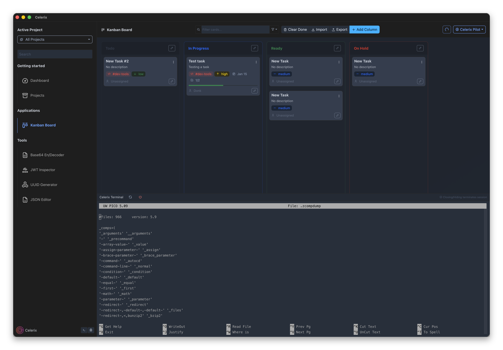

# Developer Toolbox

## What is it?

Celerix is a high-performance "Swiss Army Knife" for your daily development workflow, It leverages a Rust backend via Tauri 2.0 and a reactive Vue 3 frontend to deliver a native experience with a minimal footprint.

Core Philosophy
- Local-First: Your data stays on your machine. Import/Export functionality works directly with your local file system.
- No Bloat: A native desktop experience that stays out of your way (~35MB RAM usage).
- Privacy: No tracking, no cloud-syncing, no accounts required.

